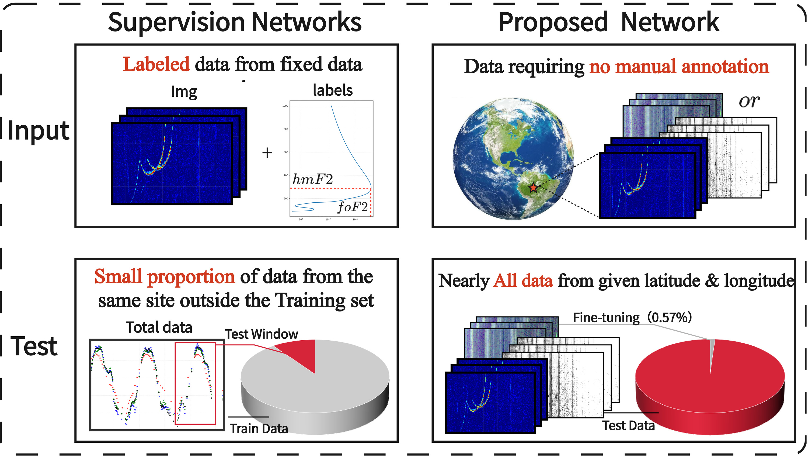
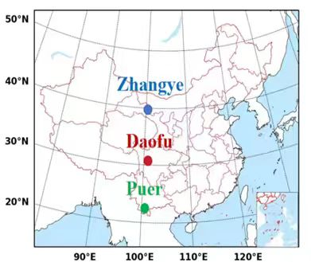
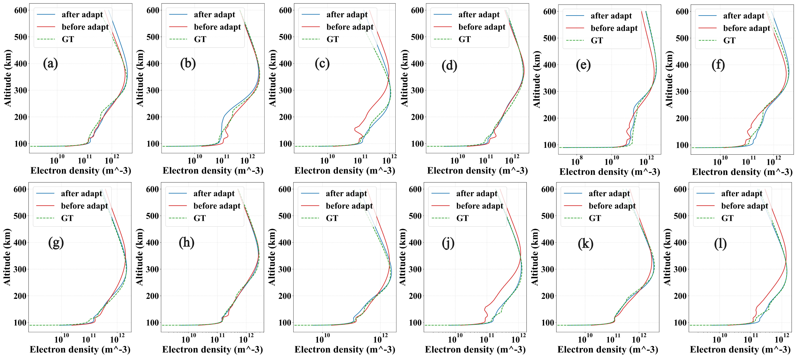
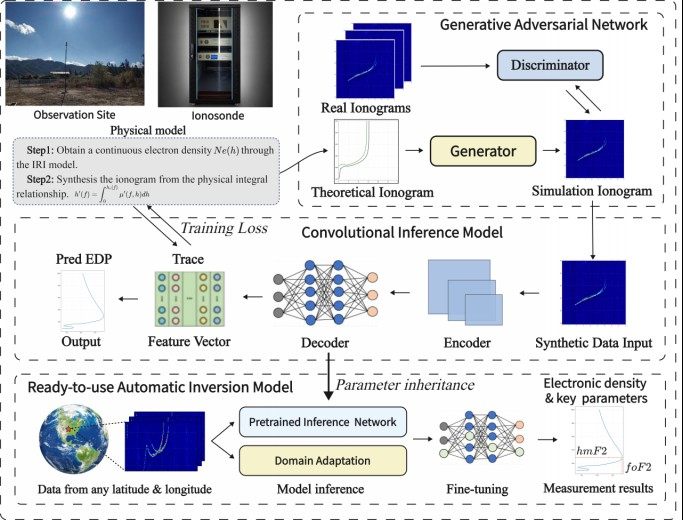

# A Label-Efficient Model for Automatically Extracting Electron Density Profile from Ionograms

<p align="center">
  IRI-2020 synthesis · CycleGAN backward domain adaptation · forward parameter extraction
</p>

<p align="center">
  <a href="#abstract">Abstract</a> ·
  <a href="#plain-language-summary">Plain Language</a> ·
  <a href="#experiments">Experiments</a> ·
  <a href="#method">Method</a> ·
  <a href="#getting-started">Code</a> ·
  <a href="#citation">Citation</a>
</p>

---

## Abstract

The ionosphere, a critical component of Earth's space environment, is ionized partially by solar radiation, energetic charged particles and cosmic rays. The free electrons in the ionosphere can affect the propagation of radio waves. It is significantly important to obtain electron density from ionograms recorded by ionosonde. Due to a vast amount of ionograms, it is impossible to manually scale ionograms to obtain ionospheric parameters. Then, many methods have been developed to automatically extract ionospheric parameters from ionograms. However, accurately extracting electron density profile from ionograms is always a challenging task. Existing deep learning approaches rely heavily on manual annotation, incurring high labor costs and difficulty obtaining sufficient training samples.

To address these challenges, this study proposes a **label-efficient theoretical data synthesis framework** for ionogram inversion. The method first generates theoretical ionograms from electron density profiles produced by **IRI-2020**. A **CycleGAN-based backward domain adaptation** network then learns the cross-domain mapping between theoretical and real observed ionograms, automatically constructing a large-scale labeled synthetic dataset. On this foundation, a **forward parameter extraction network** is trained to predict key ionospheric parameters and electron density profiles from real ionograms.

Extensive experiments on full-year 2024 data from the **Puer** station demonstrate that the proposed framework achieves high accuracy under zero- or limited-annotation conditions.

---

## Plain Language Summary

Earth has an upper atmospheric layer called the ionosphere where sunlight and particles from space strip electrons from gas atoms. These electrons alter radio signal paths, so scientists measure electron density with ionosondes that produce images called ionograms. Millions of these images make manual analysis impossible, and training computers usually requires thousands of hand-labeled examples, which is costly.

To avoid this, the team built artificial ionograms from electron density profiles generated by the IRI-2020 atmospheric model. A CycleGAN-based program learns how artificial and real images differ, then adjusts the artificial ones to look realistic, building a large training set without hand labeling. Another program then reads these images to predict key atmospheric values and electron density profiles. Tested on full-year 2024 data from Puer station, the system worked well with little or no hand labeling. Our work provides a label-efficient way to automatically analyze ionograms.

---

## Why label-efficient inversion?

Supervised networks need **labeled** ionograms from a fixed archive and can only test a **small proportion** of same-site data held out of training. The proposed network uses data that require **no manual annotation** and can be evaluated on **nearly all** records from a given latitude and longitude, with only a thin fine-tuning split.

<p align="center">
  
</p>
<p align="center">
  <sub><b>Figure 1.</b> Input and test protocol. Left: labeled, site-fixed supervision and a small test window. Right: no manual annotation; nearly all data at a given location are used for evaluation after minimal fine-tuning.</sub>
</p>

---

## Experiments

Evaluation uses ionosonde records at three stations in China: Zhangye, Daofu, and Puer.

<p align="center">
  
</p>
<p align="center">
  <sub><b>Figure 3.</b> Geographic coordinates of the test stations: Zhangye, Daofu, and Puer.</sub>
</p>

<p align="center">
  
</p>
<p align="center">
  <sub><b>Figure 4.</b> Retrieved electron density profiles before and after adaptation versus ground truth. (a) 1st Jan. 14:30:01 BJT; (b) 1st Feb. 17:00:00 BJT; (c) 1st Mar. 10:30:00 BJT; (d) 2nd Apr. 16:00:00 BJT; (e) 15th May. 18:30:00 BJT; (f) 28th Jun. 18:30:00 BJT; (g) 2nd Jul. 18:00:01 BJT; (h) 4th Aug. 16:00:00 BJT; (i) 4th Sep. 17:00:00 BJT; (j) 8th Oct. 08:30:17 BJT; (k) 1st Nov. 11:30:01 BJT; (l) 4th Dec. 11:00:00 BJT.</sub>
</p>

---

## Method

<p align="center">
  
</p>
<p align="center">
  <sub><b>Figure 2.</b> Framework. Theoretical ionograms are synthesized from IRI-2020 electron density profiles; CycleGAN learns the mapping to real ionograms; a forward network inverts parameters and the electron density profile, then adapts to observations at a given latitude and longitude.</sub>
</p>

1. **Physical synthesis.** IRI-2020 yields a continuous profile \(N_e(h)\). A theoretical ionogram follows the group-path integral
   \[
   h'(f)=\int_0^{h_0(f)}\mu'(f,h)\,dh.
   \]
2. **Backward domain adaptation (`gan/`).** CycleGAN + WGAN-GP learns the unpaired mapping from theoretical to observed ionograms and builds a large-scale labeled synthetic set.
3. **Forward extraction (`fne/`).** A convolutional network predicts key parameters (*fo*F2, *hm*F2) and the electron density profile from real ionograms, with optional domain adaptation at a new site.

---

## Repository Structure

```
.
├── gan/                 # backward domain adaptation (theoretical → real)
├── fne/                 # forward parameter / EDP extraction
└── docs/                # figures
```

Checkpoints and raw ionograms are not stored in git. See `.gitignore`.

---

## Getting Started

```bash
pip install -r gan/requirements.txt
pip install -r fne/requirements.txt
```

Install `torch` / `torchvision` from the [PyTorch](https://pytorch.org) index that matches your CUDA build.

**Stage I — CycleGAN backward adaptation**

```bash
cd gan
# data/trainA  theoretical ionograms from IRI-2020
# data/trainB  real ionograms
python train.py --no-monitor
python inference.py --direction ab --input <theoretical_dir> --output <sim_dir> --epoch 70
```

**Stage II — forward extraction**

```bash
cd fne
python Pipeline_Run.py
python adap.py --train_dir train --val_dir val --weight_path best_ionosphere_model.pth
python test.py --test_dir test --model_path best_ionosphere_model.pth
```

Command-line details: [`gan/README.md`](gan/README.md).

---

## Citation

```bibtex
@article{label_efficient_ionogram_edp,
  title  = {A Label-Efficient Model for Automatically Extracting Electron Density Profile from Ionograms},
  year   = {2026}
}
```

---

## License

Research code released for academic use. Please contact the authors before commercial use.
