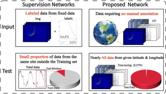

# A Label-Efficient Model for Automatically Extracting Electron Density Profile from Ionograms

<p align="center">
  <em>Physical ionogram synthesis · unpaired domain transfer · label-efficient inversion</em>
</p>

<p align="center">
  <a href="#overview">Overview</a> ·
  <a href="#method">Method</a> ·
  <a href="#repository-structure">Code</a> ·
  <a href="#getting-started">Getting Started</a> ·
  <a href="#citation">Citation</a>
</p>

This repository is the reference implementation of a **label-efficient** pipeline for automatic ionogram inversion. Instead of training a supervised network on a small, hand-labeled archive from a single station, we synthesize physically consistent ionograms, close the domain gap with an unpaired GAN, and invert real observations after only a thin adaptation step.

---

## Overview

Traditional supervision needs paired labels (`hmF2`, `foF2`, traces) and can only hold out a thin test window from the same site. The proposed model consumes **unannotated** observations at a given latitude / longitude and evaluates on **nearly all** of that site’s data, with fine-tuning on the order of **0.57%**.

<p align="center">
  
</p>
<p align="center">
  <sub><b>Figure 1.</b> Input and test-time contrast. Left: labeled, site-fixed supervision and a small held-out window. Right: no manual annotation; nearly all data at a given location are available for evaluation after minimal fine-tuning.</sub>
</p>

---

## Method

The system has three stages that correspond to the folders in this repository.

1. **Physical synthesis.** IRI provides a continuous profile \(N_e(h)\). A theoretical ionogram is formed from the group-path integral
   \[
   h'(f)=\int_0^{h_0(f)}\mu'(f,h)\,dh.
   \]
2. **Unpaired domain transfer (`gan/`).** CycleGAN + WGAN-GP maps theoretical ionograms to the appearance of real ionosonde records without paired examples.
3. **Inversion and adaptation (`fne/`).** A ConvNeXt encoder with coordinate attention regresses ionospheric parameters (e.g. \(foF2\)) from transferred or real images, then domain-adapts to a new latitude / longitude.

<p align="center">
  
</p>
<p align="center">
  <sub><b>Figure 2.</b> End-to-end flowchart: observation / IRI synthesis, GAN simulation, convolutional inversion of the electron-density profile, and a ready-to-use network with domain adaptation.</sub>
</p>

---

## Repository Structure

```
.
├── gan/                      # Stage I — theoretical → real ionogram transfer
│   ├── train.py
│   ├── inference.py          # A→B, B→A, cycle reconstruction
│   ├── models.py             # ResNet generator, PatchGAN critic
│   └── dataset.py
├── fne/                      # Stage II — parameter extraction + adaptation
│   ├── Pipeline_Run.py       # split → train → test
│   ├── train_model_attn.py
│   ├── adap.py               # freeze-backbone domain adaptation
│   └── test.py
└── docs/                     # paper figures
```

Weights and raw ionograms are **not** shipped in git (see `.gitignore`). Place local data and checkpoints as described below.

---

## Getting Started

### Environment

```bash
# Stage I
pip install -r gan/requirements.txt

# Stage II
pip install -r fne/requirements.txt
```

Install `torch` / `torchvision` from the [PyTorch](https://pytorch.org) index that matches your CUDA build.

### Stage I — Domain transfer

```bash
cd gan
# data/trainA  theoretical ionograms
# data/trainB  real ionograms
python train.py --no-monitor
python inference.py --direction ab --input <theoretical_dir> --output <sim_dir> --epoch 70
```

### Stage II — Label-efficient inversion

```bash
cd fne
python Pipeline_Run.py
# or, after a pretrained checkpoint exists
python adap.py --train_dir train --val_dir val --weight_path best_ionosphere_model.pth
python test.py --test_dir test --model_path best_ionosphere_model.pth
```

More command-line flags are documented in [`gan/README.md`](gan/README.md).

---

## Outputs

| Stage | Artifact |
|---|---|
| GAN training | `gan/checkpoints/epoch_XXX.pth`, sample grids under `gan/outputs/` |
| Transfer | simulated ionograms under `gan/results/` |
| Inversion | `fne/best_ionosphere_model.pth`, metrics and figures under `fne/test_results/` |

---

## Citation

If this code or the associated method is useful in your research, please cite the paper (bibtex will be added upon publication):

```bibtex
@article{label_efficient_ionogram_edp,
  title   = {A Label-Efficient Model for Automatically Extracting Electron Density Profile from Ionograms},
  year    = {2026}
}
```

---

## License

Research code released for academic use. Please contact the authors before using it in a commercial product.
